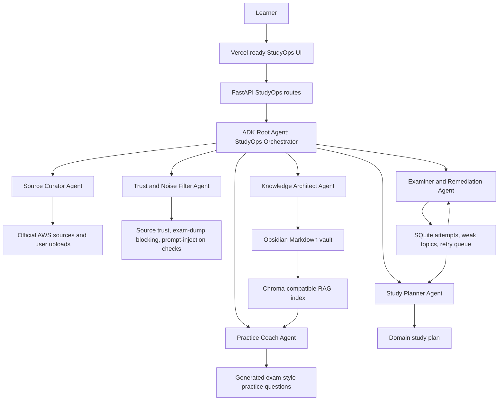

# Architecture for Writeup

## Key Data Stores

- Obsidian vault: human-readable Markdown knowledge base.
- Chroma-compatible index: retrieval over notes, with JSON fallback for local demos.
- SQLite: learner attempts, weak topics, confidence signal, and retry queue.

## Safety Boundary

All web and uploaded content is treated as untrusted. The trust layer blocks
exam-dump language, flags prompt-injection phrases, and redacts obvious secrets
or PII before storage.

